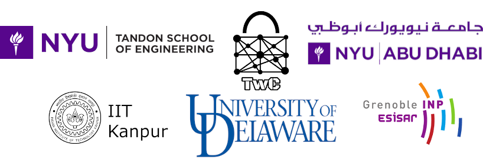

CSAW 2021 Embedded Security Challenge (ESC)
===========================================

## Quick Links

* [Registration](https://github.com/TrustworthyComputing/csaw_esc_2021#registration)
* [Deadlines/Logistics](https://github.com/TrustworthyComputing/csaw_esc_2021/blob/main/logistics.md#competition-deadlines)
* [Challenge Description](https://github.com/TrustworthyComputing/csaw_esc_2021/blob/main/challenge_description.md#esc-2021-challenge-description)
* [csaw.io/esc](https://www.csaw.io/esc)

## Overview

The Embedded Security Challenge (ESC) returns in 2021 for the 14th time, and we are proud to announce another exciting and educational global competition! ESC is part of [CSAW](https://www.csaw.io/), which is founded by the department of Computer Science and Engineering at NYU Tandon School of Engineering, and is the most comprehensive student-run cyber security event in the world, featuring international competitions, workshops, and industry events.

ESC 2021 will be a **world-wide virtual event** held simultaneously in four regions: US-Canada, Europe, Middle East & North Africa, and India, with the finals taking place on 10-14 November 2021.

-   **CSAW US-Canada**: NYU Tandon School of Engineering, Brooklyn, USA.
-   **CSAW Europe**: Grenoble Institute of Technology - ESISAR, Grenoble, France.
-   **CSAW MENA**: NYU Abu Dhabi, Abu Dhabi, UAE.
-   **CSAW India**: Indian Institute of Technology Kanpur, Kanpur, India.

The competition is organized in all regions under the supervision of Professor Nektarios Tsoutsos (University of Delaware), and the global challenge leads are Charles Gouert, Dimitris Mouris and Lars Folkerts, who are also the US-Canada region challenge leads.
In Europe, the competition is organized by Professor Vincent Beroulle.
In the MENA region, the competition is coordinated by Professor Michail Maniatakos with Likhitha Mankali as the regional challenge lead. In India, ESC is supervised by Professor Sandeep Shukla, with Rohit Negi as the regional challenge lead.

## Challenge Summary
This year's ESC focuses on side channel attacks (SCAs) and fault injection attacks (FIAs), which can be employed to exfiltrate private information from hardware. These classes of attacks have been demonstrated to leak entire encryption keys from popular cryptographic hardware, such as AES.
Teams can compete in one of two tracks: a **research** track or a **technical** track. The research track will focus on developing strategies to defeat SCAs and FIAs while the technical track will focus on crafting attacks over a series of challenges. In both tracks, a **Chipwhisperer Nano** will be used as the target hardware board.
The event comprises a qualification and a final phase where teams will be able to acquire and demonstrate their skills in mitigating/launching these powerful types of attacks in a controlled and safe environment.

Further details and specifics can be found on the [challenge description](challenge_description.md) page.

## Acknowledgements
We would like to thank Siemens for sponsoring the Chipwhisperer boards.

## Registration

Students of all university levels are invited to compete. Each team must have a **team leader** and up to 3 additional team members (a total of 4 participants per team). Each team leader is responsible for coordinating with other members of their team and will be the point of contact for the entire team. Each team should also have a university **faculty advisor**.

The team leaders need to register their team members and faculty advisor electronically at https://hotcrp.engineering.nyu.edu/, using their team name as the 'Submission Title'. ESC uses a HotCRP-based registration and submission system for both the qualification and final rounds, and teams **must register before finalizing their report and computer file submissions** by the posted deadlines.

Each team is eligible to register for **only one region** based on university affiliation: Europe, India, MENA, or US-Canada, as defined below.
While team members do not need to attend the same university, all team members must be a part of the same region.

-   **US-Canada**: Hosting students from universities located within the United States or Canada.
-   **Europe:** Hosting students from universities located in the European Union, Switzerland, Norway, Armenia, United Kingdom.
-   **India:** Hosting students from universities located in India.
-   **MENA:** Hosting students from universities located in Algeria, Azerbaijan, Bahrain, Chad, Djibouti, Egypt, Eritrea, Georgia, Iran, Iraq, Israel, Jordan, Kuwait, Lebanon, Libya, Mauritania, Morocco, Oman, Pakistan, Palestine, Qatar, Saudi Arabia, South Sudan, Sudan, Syria, Tunisia, Turkey, United Arab Emirates, or Yemen.

To be able to qualify to the final round, each team must register for the correct region based on the university affiliations of its members.

After registration closes, making changes to the existing members of a team (e.g., replacing a team member) or adding new team members, requires explicit permission from the organizers. This is also necessary for teams replacing team members or adding new team members during the final round of the competition.

For more registration information, policies, deadlines, deliverable details, and for information for contacting CSAW organizers, visit the [logistics](logistics.md) page.

**Teams are encouraged to start investigating the challenge as early as possible.**

*It is also recommended to periodically visit this repository on GitHub, as the details may be updated*.

---

    

[badge-license]: https://img.shields.io/badge/license-MIT-green.svg
